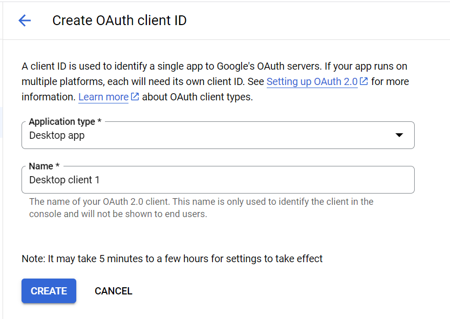
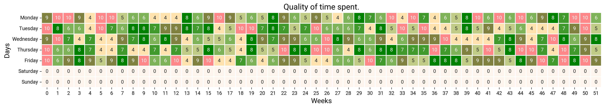
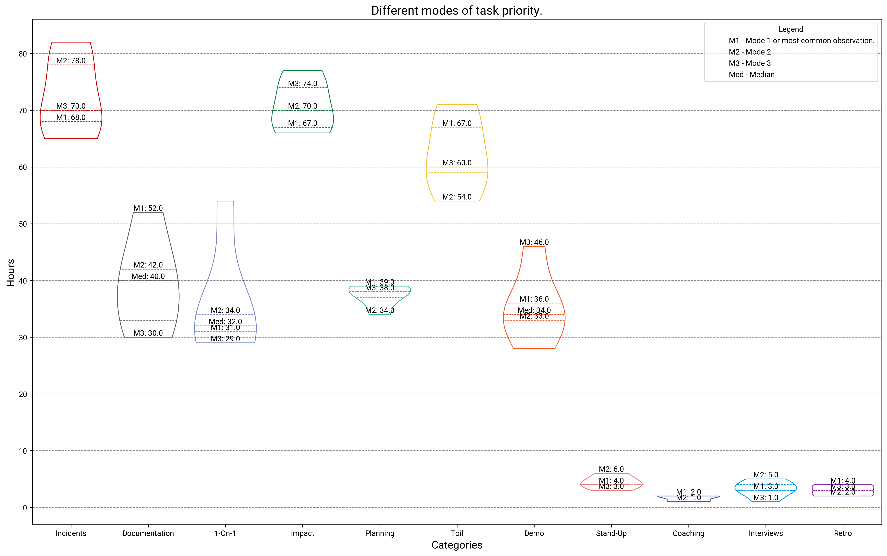
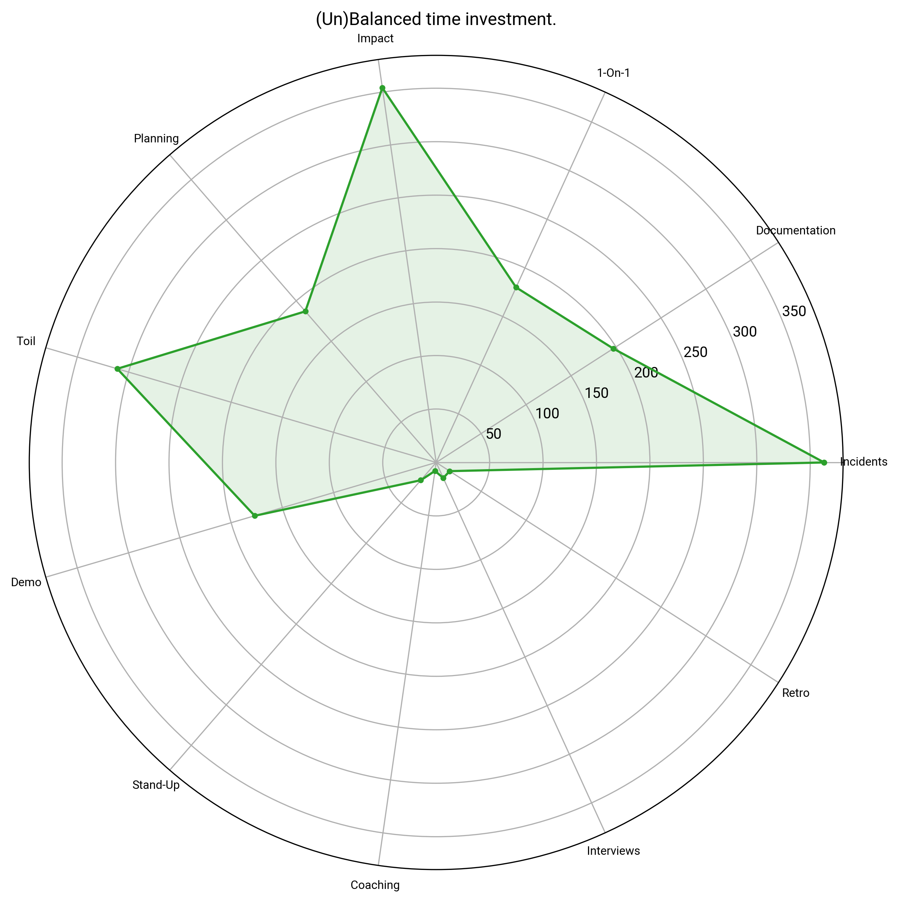

# BoxTime

An application that helps you understand the distribution of time across different categories of
tasks that you perform.

You need:

- A clone of this project.
- Google Calendar
- Habit of timeboxing tasks.


## Installation

You need:

1. Miniconda/conda or any other environment manager that allows installing and switching python versions.

    ```shell
    conda create -n timebox python=3.10 # 3.10 or higher works
    ```

2. Python 3.10 or above.
3. `git`: To clone this project.
4. jupyter notebook or vscode jupyter extension.
5. A google cloud account.

    You'd need to request credentials from google cloud to access the calendar API.
    [This guide](https://developers.google.com/calendar/api/quickstart/python) outlines the steps needed to acquire the credentials. 

    
    Once you hit create, you will be able to download the credentials. The file is originally named as `client_secret_(\d+)-[a-z0-9]+.apps.googleusercontent.com.json`

6. Create a `credentials` dir at the root and save the credential as `google.credentials.json`.
7. Launch the sketch.ipynb.
8. (Optional) You can install custom fonts if you prefer that to the default selected by matplotlib. Clearing the font cache in `~/.cache/matplotlib/` might be necessary.

## Demo

### Quality Time


This chart penalizes working longer hours as much as staggeringly less. However, this is a judgement based on quantity and misses importance of themes like:

- _Great work done efficiently_.
- _Time taken to resolve major outages._

### Category Prioritization


This chart delves deeper into the time spent, to highlight attempts at juggling various types of work. This chart values consistency and makes one-off moments clearer.

### Spread


This chart helps making comparison with others operating at the target role. This could vary by person and industry, but the area and shape can help you identify if efforts are at least in the right direction.
